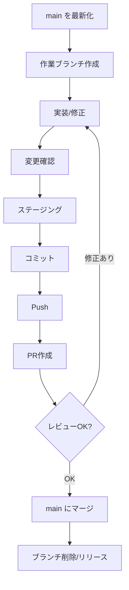

# Rakucloud株式会社 Webサイト

Rakucloud株式会社のコーポレートサイトです。Astro + Tailwind CSS を基盤に、静的サイトとしてビルド・配信します。

## 技術スタック

- Astro 5 / TypeScript
- Tailwind CSS
- Markdown/MDX（ブログ・ポリシー文書）
- ESLint / Prettier

## 要件

- Node.js: 18.17+ / 20.3+ / 21+
- npm

## セットアップ

```bash
npm install
npm run dev
```

ローカルは `http://localhost:4321` で起動します。

## 開発コマンド

- `npm run dev`: ローカル開発サーバー起動
- `npm run build`: 本番ビルド（`dist/`）
- `npm run preview`: ビルド成果物のローカル確認
- `npm run check`: Astro/ESLint/Prettierの一括チェック
- `npm run fix`: ESLint/Prettierの自動修正

## レビュー手順

- PRには変更概要・影響範囲・確認方法を記載
- UI変更はスクリーンショットまたは画面録画を添付
- `npm run check` を通す（必要に応じて `npm run preview` で動作確認）
- 原則1名以上のレビューを受ける

## Git運用

- `main` へ直接コミットせず、必ず作業ブランチを作成してPRで進める
- 変更は小さくコミットし、Conventional Commits に従う
- PRでレビュー依頼し、`npm run check` が通ることを確認
- 承認後に `main` へマージし、必要に応じてリリース

作業の流れ（初心者向け・詳細）:

1) `main` を最新化して作業開始

```bash
git checkout main
git pull
```

2) 作業ブランチを作成

```bash
git checkout -b feat/add-blog-post
```

ブランチ名例: `feat/...`, `fix/...`, `chore/...`, `docs/...`

3) 変更の確認（作業中はこまめに）

```bash
git status
git diff
```

4) ステージングとコミット

```bash
git add src/pages/index.astro
git commit -m "feat: update hero copy"
```

必要に応じて `git add -p` で差分を分割して追加する

5) リモートへPushしてPR作成

```bash
git push -u origin feat/add-blog-post
```

PRでは変更概要・影響範囲・確認方法を記載し、レビューを依頼する

6) レビュー対応（差分修正が入った場合）

- 修正 → `git add` → `git commit` → `git push`
- `main` の更新を取り込む必要があれば以下を実行

```bash
git fetch origin
git merge origin/main
```

コンフリクトが出た場合は該当ファイルを修正 → `git add` → `git commit`

7) マージ後の片付け

```bash
git checkout main
git pull
git branch -d feat/add-blog-post
git push origin --delete feat/add-blog-post
```

コミットメッセージ例（Conventional Commits）:

- `feat: add blog post template`
- `fix: correct contact link`
- `docs: update README`



## ディレクトリ構成

- `src/pages/`: ルーティング（`/`、`/about`、`/team` など）
- `src/components/`: UIコンポーネント、ウィジェット
- `src/assets/`: 画像・スタイル（importして使うアセット）
- `src/data/post/`: ブログ記事（MD/MDX）
- `public/`: 変換不要の静的ファイル

## 主要ページ

- `src/pages/index.astro`: トップページ
- `src/pages/about.astro`: 会社情報
- `src/pages/team.astro`: チーム紹介（メンバーは `teamMembers` 配列で管理）
- `src/pages/solution/*.astro`: ソリューション詳細
- `src/pages/contact.astro`: お問い合わせ
- `src/pages/privacy.md` / `src/pages/terms.md` / `src/pages/electronic-notice.md`: 規約・ポリシー
- `src/pages/[...blog]/*`: ブログ一覧・詳細
- `src/pages/homes/*` / `src/pages/landing/*`: テンプレート用ページ（不要なら整理）

## よく触る設定

- `src/config.yaml`: サイト名・SEO・ブログ設定など
- `src/navigation.ts`: ヘッダー/フッターのナビゲーション
- `src/assets/styles/tailwind.css`: グローバルスタイル
- `src/components/CustomStyles.astro`: フォントや追加スタイル

## ブログ追加方法

- 記事は `src/data/post/` に `slug-base-name.md` / `slug-base-name.mdx` で追加
- `title` は必須、`publishDate` は並び順に影響（新しい順）
- `draft: true` を付けると一覧・詳細ページに出さない
- 画像は `https://...` / `/` 配下（`public/`）/ `~/assets/images/...` のいずれかで指定可能
- スキーマは `src/content/config.ts`、URL設計は `src/config.yaml` で管理

フロントマター例:

```md
---
title: 記事タイトル
publishDate: 2024-06-01T00:00:00Z
excerpt: 記事の概要
author: 部署名 or 氏名
category: AI
tags:
  - タグ1
  - タグ2
image: https://example.com/hero.jpg
draft: false
metadata:
  canonical: https://www.rakucloud.co.jp/blog/slug-base-name
---
```

## 画像・アセット

- 変換不要の画像は `public/` へ
- 画像を最適化したい場合は `src/assets/` に置き、`Image` コンポーネント経由で利用

## リリース手順

1. `npm run check`
2. `npm run build`
3. `npm run preview` で主要ページを確認
4. デプロイ方法を選択
   - Netlify/Vercel: 設定ファイル（`netlify.toml`, `vercel.json`）に従ってデプロイ
   - 静的配信: `dist/` をホスティング環境へアップロード
   - Docker: `docker compose up --build` でNginx配信（`http://localhost:8080`）

## メンテナンスのヒント

- ナビ追加は `src/navigation.ts` を更新
- 会社情報/連絡先の変更は `src/pages/about.astro` / `src/pages/contact.astro` / `src/pages/privacy.md` を確認
- コーディング規約は `AGENTS.md` を参照
