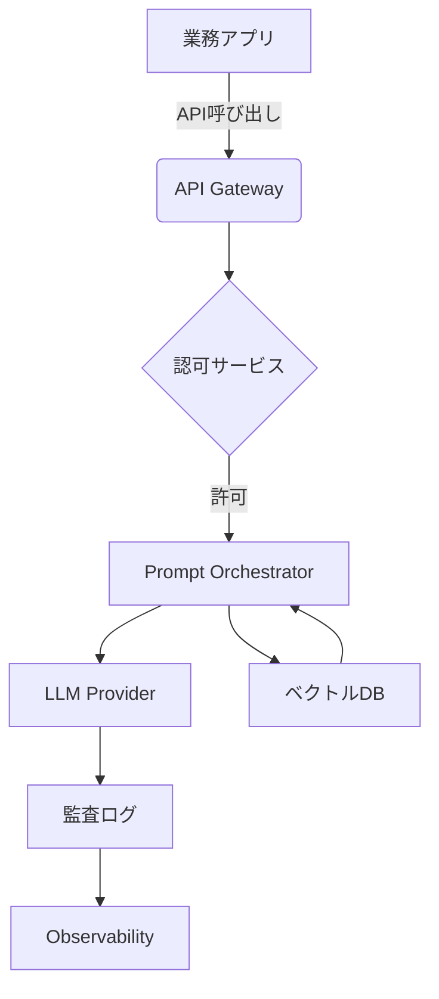

## システム全体像のリファレンスアーキテクチャ



- **Prompt Orchestrator**: テンプレート管理、変数差し込み、マルチモデル配分を制御します。
- **Observability**: 生成結果とメタデータをData Warehouseへ送信し、品質評価とコンプライアンス監査を両立します。
- **セキュアゲートウェイ**: 個人情報を含む入力はPIIマスキングを施し、暗号化されたチャネルでモデルに送信します。

## 品質評価とガードレール設計

1. **自動評価指標の定義**: 事前に定義した期待出力に対してBLEUやROUGEなどの自動評価を組み合わせ、閾値管理を行います。
2. **Human-in-the-Loop**: 重要業務はレビュアーによるフィードバックワークフローを用意し、評価結果を学習データにフィードバックします。
3. **プロンプト監査**: Prompt変更はPull Requestでレビューし、テスト用のゴールデンセットで差分を比較します。

```yaml
approval_flow:
  reviewers:
    - ai-lead@rakucloud.co.jp
    - compliance@rakucloud.co.jp
  checks:
    - unit-tests
    - golden-set-regression
    - security-scan
```

## 運用時に押さえるセキュリティとコンプライアンス

- **データ最小化**: プロンプトに含める情報は必要最低限とし、ユーザー属性はトークン化して扱います。
- **APIレート制御**: モデルベンダーのレートリミットを考慮したスロットルをAPI Gatewayで設け、過負荷時はキューに退避します。
- **ログ保全**: 生成結果、プロンプト、メタデータを暗号化して保管し、アクセス権限をRBACで制御します。

## 継続改善のための運用プロセス

- **モニタリング**: 応答遅延、エラー率、ユーザー満足度をObservabilityツールに集約し、SLO違反時に自動アラートを発報します。
- **モデル更新**: モデルバージョンをSemVerで管理し、Blue/Greenデプロイで切り替えます。回帰が検知された場合は即時ロールバックできるようにします。
- **ビジネス価値の可視化**: 利用ログから定量的なKPI（解決工数削減率など）を算出し、経営層へのレポーティングを月次で実施します。

生成AIはスピード感のある改善が求められます。MLOpsとガバナンスを両立させる運用プロセスを整備し、安心して価値創出できる体制を構築しましょう。
